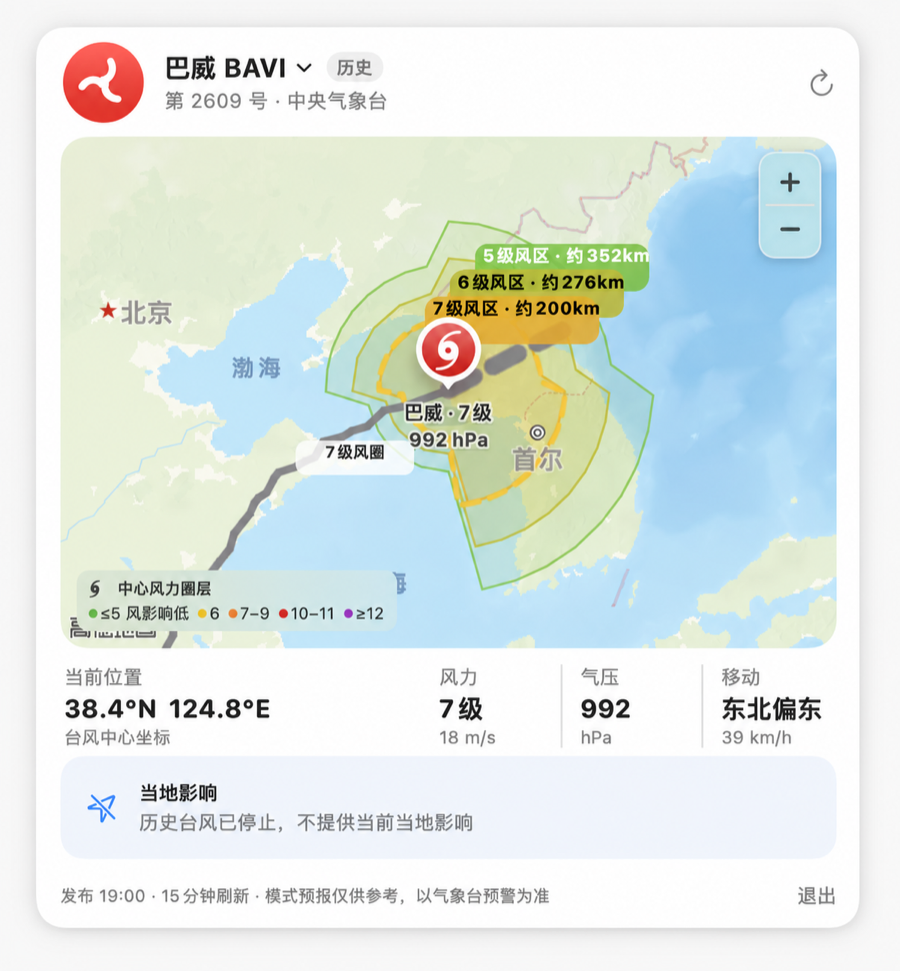
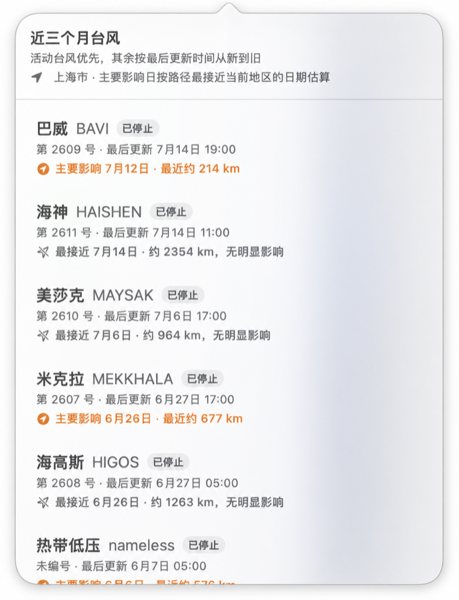
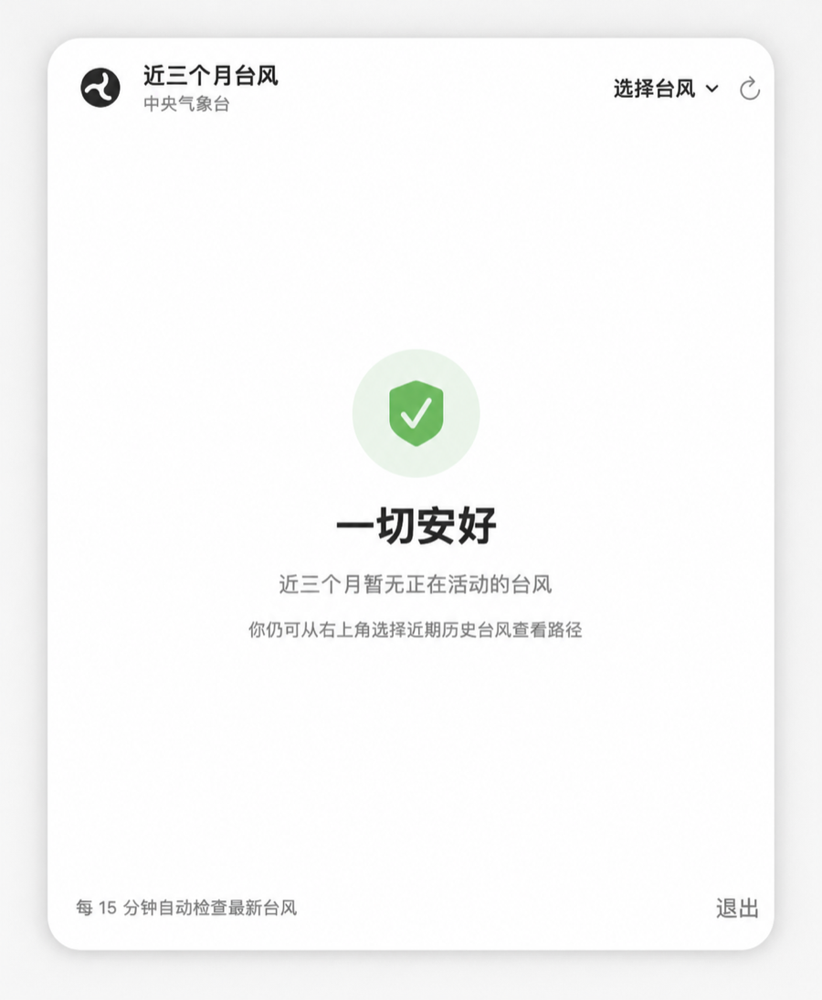

# TyphoonBar

[](LICENSE)
[](https://www.apple.com/macos/)
[](https://www.swift.org/)


TyphoonBar 是一个常驻 macOS 菜单栏的轻量台风监测工具：

- 浏览近三个月台风，自动优先展示活动台风，也可手动切换历史台风；
- 查看中心位置、强度、气压、实况/预报路径及四象限风圈；
- 根据 Mac 定位估算台风最接近当地的日期、距离和主要影响时间；
- 汇总当地未来 24 小时降雨、持续风、阵风趋势与安全提示；
- 每 15 分钟自动刷新；没有活动台风时显示简洁的平安状态。

> [!IMPORTANT]
> TyphoonBar 是独立开发的开源项目，不是气象主管机构的官方客户端。距离、影响日期、风险等级和安全提示均包含算法估算，不能替代官方预报、预警或应急指令。“一切安好”仅表示最近一次成功更新时未从当前数据源识别到活动台风。

## 界面预览

<p align="center">
  
  
</p>

<p align="center">
  
</p>

主面板展示路径、风圈和中心指标；选择列表补充状态、更新时间、当地主要影响日期与最近距离；没有活动台风时则显示简洁的“一切安好”状态。截图经过展示化裁切与背景清理，界面中的地图、系统符号、机构名称和气象数据仍分别受其提供方条款约束。素材说明见 [`docs/images/README.md`](docs/images/README.md)。

## 项目状态

项目目前处于开发阶段，尚未作为完成数据授权与 App Store 合规审核的正式版本发布。中央气象台、Open-Meteo 和 Apple 服务均有各自条款；复制、修改或分发本项目时，请先阅读[第三方声明](THIRD_PARTY_NOTICES.md)和[数据来源说明](DATA_SOURCES.md)。

## 构建与运行

需要 macOS 14 或更高版本，以及 Xcode Command Line Tools。

```bash
chmod +x build_app.sh
./build_app.sh
open dist/TyphoonBar.app
```

首次启动如果被系统拦截，可在 Finder 中右键应用并选择“打开”。应用采用本机临时签名，不会显示 Dock 图标。

## 数据与限制

应用在运行时读取中央气象台台风网数据，用于展示实况、路径和分级风圈。百公里圈层的典型风级取 Open-Meteo 模式网格中位数，并使用中央气象台 7 / 10 / 12 级风圈校准内圈强度；它不等同于地面测站实况。当地逐时风雨同样使用模式预报并结合台风路径计算影响时段。

第三方数据不受本项目 Apache-2.0 许可证覆盖。Open-Meteo 数据要求署名，其免费 API 适用范围受当前服务条款限制；中央气象台数据的下载、再发布和衍生利用权也不会因本仓库开源而自动取得。详细信息见：

- [数据来源与计算方法](DATA_SOURCES.md)
- [第三方声明](THIRD_PARTY_NOTICES.md)
- [项目资源授权](ASSETS.md)
- [完整免责声明](DISCLAIMER.md)

应用只把定位坐标用于请求当地天气和在内存中计算影响，不存储位置。首次打开当地影响区域时，macOS 会询问定位权限。

更多信息见[隐私说明](PRIVACY.md)。

## 参与贡献

欢迎报告问题、改进界面、完善测试或提出有明确授权的数据源。请先阅读[贡献指南](CONTRIBUTING.md)。安全漏洞请遵循[安全政策](SECURITY.md)，不要在公开 Issue 中提交精确位置、密钥或未修复漏洞。

## 开源许可证

项目代码和文档采用 [Apache License 2.0](LICENSE)；贡献者署名见 [NOTICE](NOTICE)。该许可证不包含第三方气象数据、地图内容、服务名称、Logo 或商标。当前 App 图标在来源核验完成前也暂不纳入开源授权，详见[项目资源授权](ASSETS.md)。提交贡献即表示你拥有相应权利，并同意按 Apache-2.0 授权贡献内容。
